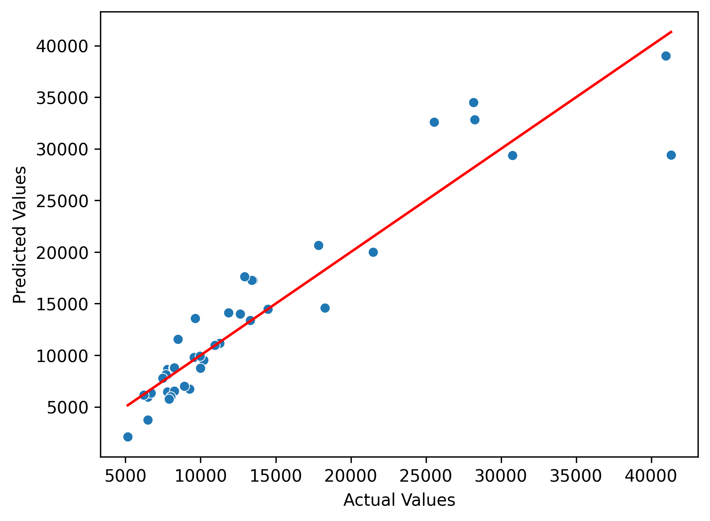

#Car Price Prediction with Linear Regression

This project aims to predict car prices using a **linear regression model** trained on the [Car Price Prediction Dataset](https://www.kaggle.com/datasets/hellbuoy/car-price-prediction).  

## Dataset
- **Source:** Kaggle – Car Price Prediction Dataset  
- **Features:** "CarName" (dummy), "fueltype", "aspiration", "doornumber", "carbody" (dummy), "drivewheel" (dummy), "enginesize", "horsepower", "citympg", "highwaympg", etc.  
- **Target variable:** `price`

## Installation
Python 3.10+ is recommended to run this project.  

```bash
# Create virtual environment (optional but recommended)
python -m venv .venv
source .venv/bin/activate      # Windows: .venv\Scripts\activate

# Install required packages
pip install -r requirements.txt
```
## Results

After training the linear regression model, the following results were obtained:

- **Intercept:** 13223.41  
- **Coefficients:** [330.45, 403.46, 345.89, 2522.73, -18.31, 1726.32, ...]  
  *(only showing a subset for readability)*  
- **Mean Squared Error (MSE):** 9,972,068.10  
- **R² (Coefficient of Determination):** 0.87  

### Performance Summary
| Metric | Value |
|--------|-------|
| Intercept | 13223.41 |
| MSE | 9,972,068.10 |
| R² | 0.87 |

The plot below shows predicted vs. actual car prices:  



## License
This project is licensed under the MIT License - see the [LICENSE](LICENSE) file for details.

## Usage

Run the project by simply executing:

```bash
python main.py
```
